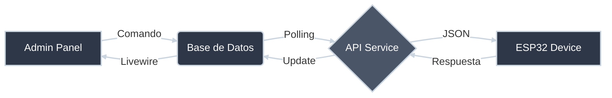

  

   

  

    
    
    
    
    
  

   

---

  <blockquote>
    <h3>Innovación y Seguridad en Sincronía</h3>
    

      <b>ElectroCode</b> redefine la gestión corporativa fusionando la seguridad física con la eficiencia administrativa. 
      Más que un simple sistema de asistencia, es una plataforma viva que conecta el flujo de personal con tecnología IoT en tiempo real.
    

  </blockquote>

 

## La Propuesta de Valor

<table border="0">
  <tr>
    <td width="50%" valign="top" style="border: none;">
      <h3 align="center">Seguridad Activa</h3>
      
Monitoreo constante y reacción inmediata. El sistema integra un módulo de alarmas con gestión de estados en tiempo real.

      <ul>
        <li>Estados: <code>Activa</code>, <code>En Espera</code>, <code>Apagada</code></li>
        <li>Control remoto vía Web</li>
        <li>Feedback instantáneo de sensores</li>
      </ul>
    </td>
    <td width="50%" valign="top" style="border: none;">
      <h3 align="center">Biometría Avanzada</h3>
      
La identidad es la llave. Nuestro módulo de <b>Enrollment</b> gestiona huellas dactilares con precisión milimétrica.

      <ul>
        <li>Sincronización Server ↔ IoT</li>
        <li>Wizard de registro en 3 pasos</li>
        <li>Validación de calidad de huella</li>
      </ul>
    </td>
  </tr>
</table>

 

## Stack Tecnológico

  
<b>Click para desplegar detalles técnicos</b>

   
  

    <table>
      <thead>
        <tr>
          <th>Layer</th>
          <th>Tecnología</th>
          <th>Descripción</th>
        </tr>
      </thead>
      <tbody>
        <tr>
          <td><b>Backend Core</b></td>
          <td><code>Laravel 12</code></td>
          <td>Framework PHP robusto y seguro (PHP 8.2+)</td>
        </tr>
        <tr>
          <td><b>Admin Interface</b></td>
          <td><code>FilamentPHP v4</code></td>
          <td>Panel administrativo TALL stack de última generación</td>
        </tr>
        <tr>
          <td><b>Interactivity</b></td>
          <td><code>Livewire & Alpine.js</code></td>
          <td>Experiencia de usuario dinámica sin complejidad de SPA</td>
        </tr>
        <tr>
          <td><b>IoT Firmware</b></td>
          <td><code>C++ / Arduino</code></td>
          <td>Lógica de control para microcontroladores ESP32</td>
        </tr>
        <tr>
          <td><b>Infraestructura</b></td>
          <td><code>Docker</code></td>
          <td>Contenedorización completa para despliegue consistente</td>
        </tr>
      </tbody>
    </table>
  

 

## Arquitectura IoT

El corazón invisible del sistema. Una arquitectura de **Polling** y colas de comandos asíncronas orquesta la comunicación con microcontroladores ESP32.

---

   
  
<b>ElectroCode Team</b>

  
<i>Innovación y seguridad en cada línea de código.</i>

  
© 2025

   

